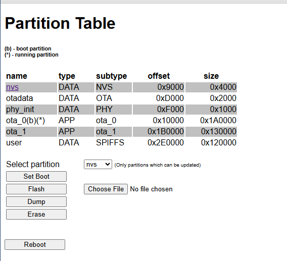
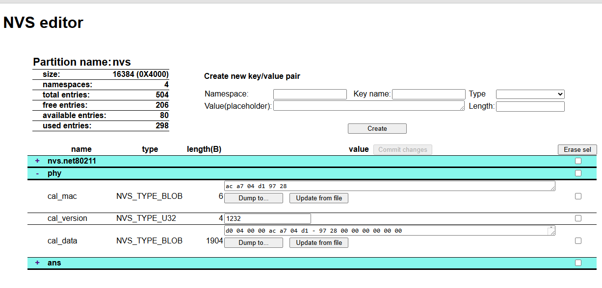

# ESP32-prov
An extensive provisioning tool for ESP32 with web interface
It allows 
- partition operations: flash, dump, erase, set boot 
- NVS in place editor: create/delete keys, edit value, dump/load BLOB type keys to/from file
- SPIFFS or FAT file system operations: list, upload, download, delete files

ESP32 runs the HTTP and websockets server and generates the pages. The web browser client interacts with the ESP32 server via http requests and websocket messages.

## HTTP URI handlers
All the uri handlers are registered in function **start_file_server()** (file_server.c file)

| URI | handler | method | javascript method |
description
 |
|-----|---------| --- |---|-----|
| **/** | root_get_handler | HTTP_GET | NA |creates main.html page|
| **/a** | root_update_handler | HTTP_POST| **update()** (main.html)|used to reboot the target|
| **/download/*** | dump_get_handler | HTTP_GET | **dump()** (main.html) |dump partition to file  **.../download?<partition_name>**|
| **/upload/*** | flashing_post_handler | HTTP_POST |**upload()** (main.html)| flash partition with file content **.../upload?<partition_name>** |
|**/nvs_editor.html**| nvs_get_handler | HTTP_GET | NA | generates nvs_editor.html **.../nvs_editor.html?<partition_name>**|
| **/nvskdownload/***| nvskey_get_handler | HTTP_GET | **dump()** (nvs_editor.html)| dump NVS key to a file - only BLOB type|
| **/ws**| ws_handler | HTTP_GET | **ws_send() ws_receive()**| implements websockets communication

## websockets communication
### Server side (esp32)
Implemented by *ws_handler()* in handlers.c file
**1. Incomming packets**
1.1 when request received with HTTP_GET method a websocket channel is open and the file descriptor of the  channel is saved for further use.
1.2. any other request are handled as websocket frames
1.2.1 control type packets received: HTTPD_WS_TYPE_PONG, HTTPD_WS_TYPE_PING, HTTPD_WS_TYPE_CLOSE are processed locally by ws_handler() function
1.2.2 data type packets: HTTPD_WS_TYPE_TEXT and HTTPD_WS_TYPE_BINARY are packed in a **wsmsg_t** structure and passed to **ws_handler_task()** via message queue **ws_msg_queue** for processing.

**2. Outgoing packets** (only data type packets)
ws_client_handler.c implements 2 functions used to send data to client (web browser):
- send_strmsg()
- send_binmsg()

the difference is only in the way packet length is calculated: for string messages packet length is strlen() of the message, while for binary message the length is provided as parameter in the function call.
Both functions wraps **httpd_ws_send_frame_async()** call.

### Client side (web browser)
All generated pages contains \ section which embeds the javascript code used by client to handle communication with the server and page behavior.
HTML **body** executes onLoad="pageload()" which establish websocket communication with the server.

    var c_connected = false;
    var websocket  = null;
    function pageload()
        {
        ...
        const wsUri = window.location.origin + "/ws";
	    websocket = new WebSocket(wsUri);
	    websocket.addEventListener("open", () => {console.log("CONNECTED"); c_connected = true;});
	    websocket.addEventListener("close", (event) => {console.log("DISCONNECTED: " + event.data); c_connected = false;});
	    websocket.onmessage = (msg) => {ws_receive(msg);};
        ...
        }

To send/receive messages each page uses 2 javascript functions: **ws_send()** and **ws_receive()**.

## Partition table operations

List of partitions, as they are defined in the .csv file used to generate partition table.
Selectable partition combo which includes only partitions whose content can be modified. This includes partitions which have the following subtype: NVS, OTA_xx, APP, SPIFFS, FAT

The operations are applied to the selected partition in the combo.
If partition subtype NVS is present in the list, it can be edited in detail in "nvs_editor" page.

# In place NVS editor

