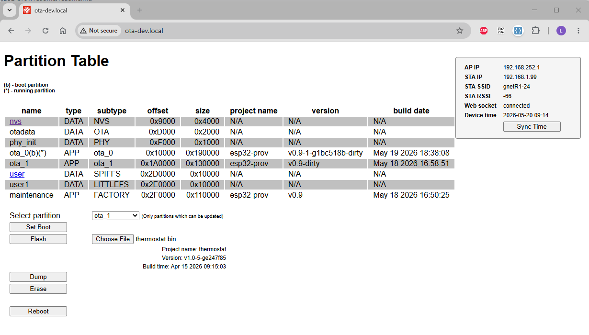
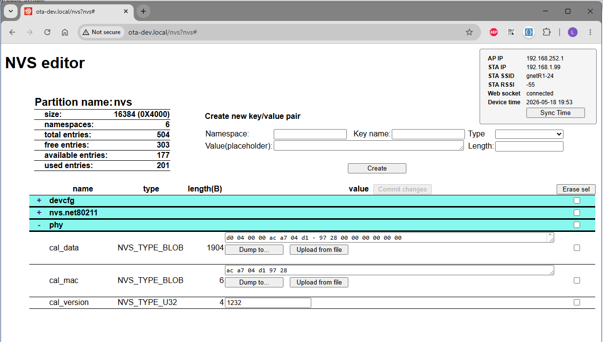

# ESP32-prov
An engineering tool tool for provisioning ESP32 with web interface
It allows 
- partition operations: flash, dump, erase, set boot 
- NVS editor: create/delete keys, modify values, dump/load BLOB keys to/from file
- SPIFFS and LITTLEFS file system operations: [under development]

The tool is intended to be flashed in a dedicated partition (~1.1MB) which can be booted when needed, to update running applications, NVS content, or filesystem.

ESP32 run HTTP and websockets server and generates the pages. The client interface and interactions are done using a web browser.
HTML template pages and javascript files (which are plenty) are embedded in the tool image.

ESP32 device acts as a standalone WiFi AP with the default settings in *common_defines.h*:

  ```
  #define DEFAULT_AP_SSID			"OTA-dev"
  #define DEFAULT_AP_PASS			"OTA-devpass"
  #define DEFAULT_AP_HOSTNAME	    	"ota-dev.local"
  #define DEFAULT_AP_IP			(1<<24) | (252 <<16) | (168 << 8) | 192 //192.168.252.1
  ```

This is primary interface and is always available.
It also starts the STA mode and looks into default NVS partition (**"nvs"**) for the namespace **nvs.net80211**. If found and if found the keys **sta.ssid** and **sta.paswd**, then try to connect in STA mode

In best case if connection succeeds, will expose a secondary IP interface, together with DEFAULT_AP_IP, whose address is provided by the connected AP. The device can be accessed on any exposed interface.

To preserve the NVS content WiFi on ESP32 is using WIFI_STORAGE_RAM.

## Partition operation
When accessed the device at the address `http://ota-dev.local` or `http://ota-dev.local/part` it opens partition operation page



The page shows the existing partitions in device flash with their attributes and provides several buttons which allows the user to manipulate the content of the partitions.
**The tool does not allow repartitioning of the device flash.**
 The available options are applied to the selected partition from the dropdown box:
 - ***Set BOOT***
    - allows changing the boot partition
    - allowed only if selected partition contains an executable image

- ***Flash***
  - flash selected partition with the content of chosen file
  - if chosen file contains an ESP32 executable image, then project name, version and build date of the executable will be shown
- ***Dump***
    - dump the content of the selected partition to a local file
 - ***Erase***
    - erase the content of selected partition
 - ***Reboot***
    - reboots the connected target.

  If partition type is **DATA** and subtype is **NVS**, by clicking on the name, opens partition editor page.

 ## NVS editor
 This page can be accessed either directly `http://ota-dev.local/nvs?[part-name]`, with [part-name] = name of the NVS partition, or by clicking on its name in the partition table.


Top left table is populated with information about the NVS selected partition. These information are returned by `nvs_get_stats(const char* part_name, nvs_stats_t* nvs_stats)`
function.

On the top right are the controls used to create a new key.

While the fields **namespace**, **key name**, **type** and **length** are self-explanatory, will say few words about **Value(placeholder)** field. 
>If the key type is numeric (`NVS_TYPE_U8` to `NVS_TYPE_I64`) the value typed here is the numeric value of the key in decimal format. A small java-script function will prevent typing anything else than numbers or '-' sign on the first position. Also the length field is automatically populated and cannot be changed.
>
>If the key type is string or blob user can type whatever whishes in this field, but it is taken as a placeholder. This means if the value in the **Length** field is larger than the size of string typed in **Value(placeholder)**, then the string is duplicated up to the length in the **Length** field. If smaller then it is truncated. Bottom line in NVS will be written a key of size = **Length** value. (if key is of type string, then the size will be +1 to include the null terminating)

Bottom half shows the list of keys grouped by namespaces.
For each key, are shown the properties and the value. The value is shown in a **textarea** or **input** control, depending on key type. **textarea** allows vertical resizing to accommodate large size keys.
Value can be changed following the below rules, based on the JS class assigned to input/textarea control:
- class "ued": numeric keys, accepts only numbers - NVS_TYPE_U[x] type
- class "ied": numeric keys, accepts only numbers and "-" sign on the first position - NVS_TYPE_I[x] type
- class "sed": string keys, accepts any character - NVS_TYPE_STR type, while typing the length is automatically updated
- class "hed": blob keys - NVS_TYPE_BLOB type, is using a minimal HEX editor
-- content is shown in a fixed format as a string of 2 digit nibbles, 16 on a line
-- user can dump or upload to/from local files.
> **HEX editor limitations**
> Allows only overwriting. It cannot add or remove content which could modify the length of the key. 
> If this is needed, then use an external editor, generate the needed file and then upload it using "Upload from file" button


>**BLOB keys limitations**

> ESP32 allows a max size of a BLOB key up to 508,000 bytes (https://docs.espressif.com/projects/esp-idf/en/stable/esp32/api-reference/storage/nvs_flash.html) and reading or writing a key using nvs API: `nvs_get_xxx()` or `nvs_set_xxx()`, is all or nothing (at least i could not find an easy way to read/write large keys in chunks).
So, reading/writing a key requires space to be allocated in RAM equal with key size. 
If the chip has PSRAM, sizes like above might fit othherwise, interanal RAM becomes a limitation.
When reading large keys, the application uses the buffer reserved for `file_server_data.scratch` which is a static area  defined in `file_server.h`

```
  #define SCRATCH_BUFSIZE  	8192
  #define MAX_BLOB_SIZE	SCRATCH_BUFSIZE

  struct file_server_data {
      /* Base path of file storage */
      char base_path[ESP_VFS_PATH_MAX + 1];

      /* Scratch buffer for temporary storage during file transfer */
      char scratch[SCRATCH_BUFSIZE];
  };
```
>When writing large keys the allowed size of the key is limited by the available heap at runtime at the moment when frontend send the update request (`nvs_op.c`)
```
  ...
  //upd_len is the key size to be written
  void *b = calloc(1, upd_len);
  ...
```
>Tested on a ESP32-C3 (the poor relative of the family - 400kB SRAM "only") min heap  is roughfly ~60kB.


## Building image

There are 3 components required to build the esp32 image:
1. This repository

2. `esp32_common` repository - part of it.
Not all the files in esp32_common are required. See CMakeList.txt to identify them

3. MDNS external dependency
run `idf.py add-dependency esperssif/mdns`


